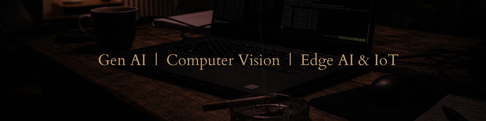

# Aditya Sarkar,
 

  <!-- replace [LINK_TO_YOUR_HOSTED_IMAGE.png] with your direct image URL -->
   

 
 
### About Me  

- Research and Development @ **National Institute of Technology, Durgapur**.
- Focused in designing and developing multimodal intelligent systems for Computer Vision.
- Expertise in Computer Vision, Retrieval Augmented Generation Systems & Deep Neural Nets.
- Currently exploring Embedded Systems, IoT, Edge AI and Distributed Systems.

---

### Tech Stack and Skills 

  

> **Data Science & ML Stack:** PyTorch | Pandas | Matplotlib | Seaborn | ScikitLearn | Tensorflow | Keras 

---

### Connect with me

  
  

---

